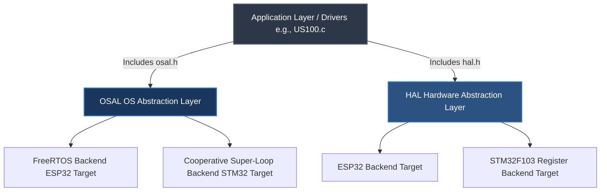

# Dual-Architecture Embedded Framework

A highly modular, dual-backend embedded firmware system demonstrating clean Operating System Abstraction Layer (OSAL) and Hardware Abstraction Layer (HAL) design patterns. This project showcases completely portable application logic capable of running on high-level RTOS frameworks (**ESP32 via ESP-IDF**) as well as low-level register-driven targets (**Bare-Metal STM32F103**).

---

## 🏗️ Architectural Layout

The software is structured with a strict dependency inversion hierarchy. The Core Application and device drivers possess zero knowledge of the underlying microchip registers or operating system execution layers.




### Key Software Engineering Pillars

* **Compile-Time Word Size Aliasing:** Implements deterministic, zero-overhead pointer-width evaluation via `UINTPTR_MAX`. Types like `uint_m` and constants like `SYS_SIZE` dynamically match the 32-bit width of target MCUs or 64-bit width of host verification environments automatically.
* **Event-Driven Ultrasonic Driver (US100):** A highly optimized, non-blocking sensor driver. Instead of using CPU-heavy polling loops, it utilizes an edge-triggered GPIO **Interrupt Service Routine (ISR)** to capture raw hardware pulse transitions with microsecond precision, passing data safely to the application layer via ISR-safe OSAL primitives.
* **Safe Encapsulated Primitives:** Prevents raw pointer leaks by wrapping critical OS structures (like `osal_queue_t` and `osal_taskhandle_t`) inside structured pass-by-value wrappers.
* **Memory-Bounded Diagnostic Logging:** Directs a thread-safe, context-tagged variant of `printf` through `esp32_log_info` using bounded stack allocation arrays and `vsnprintf` to completely eliminate risks of heap fragmentation or stack-smashing buffer overflows.

---

## 🛠️ Features & Implemented Modules

### ⏱️ Advanced Deterministic Timing & Portability
* **Dual-Engine Time Slicing:** Engineered a hybrid timing system utilizing sub-millisecond hardware clocks (`esp_timer`) for microsecond-precision pulse measurement alongside deterministic FreeRTOS tick counters for macro-level task scheduling.
* **Deterministic Time-to-Tick Translation:** Encapsulated all OSAL delay primitives to automatically compute compile-time and runtime millisecond-to-RTOS-tick translations ($ms \rightarrow \text{ticks}$), ensuring application logic remains completely decoupled from the underlying kernel's clock frequency ($f_{\text{tick}}$).
* **Cross-Architecture Type Safety:** Enforced absolute type determinism across all abstraction interfaces using `<stdint.h>` primitives, utilizing custom architecture-mapped macros (`UINT_M`) within the OSAL to guarantee variable width compliance regardless of compilation on 32-bit silicon or a 64-bit host simulation PC.

### 🔄 Event-Driven State-Machine & ISR Handoff
* **Atomic Struct State Packaging:** Designed a non-blocking ISR handoff mechanism that packages edge-triggered pulse timestamps into specialized tracking structures, leveraging low-overhead state notification callbacks to alert application tasks the exact microsecond a complete measurement lifecycle finishes.
* **OSAL Core Subsystem:** Standardized abstract interfaces for multi-task scheduling primitives, binary signaling notification states, absolute loop delays (`osal_task_delay_until_ms_default`), and thread-safe queue pipelines.
* **Ultrasonic Distance Sensing Driver (US100):** A completely hardware-agnostic sensor driver that executes logic entirely through abstract HAL GPIO and UART interface boundaries.
* **Strict Build Enforcements:** Pre-configured via CMake to force `-Wall -Wextra -Werror` compiler flags strictly on custom logic targets while allowing vendor framework dependencies to build unmodified.

---

## 🚀 Project Evolution Roadmap

This project was built using an organic, test-driven refactoring pipeline—moving step-by-step from raw hardware execution to a fully decoupled, production-ready architecture:

### 🟢 Done
- [x] **Phase 1: Framework Prototyping** – Established baseline sensor execution by driving the US100 Ultrasonic Sensor using the native ESP-IDF HAL.
- [ ] **Phase 2: Event-Driven Optimization** – 
    - [x] **2.1 Migration to ISR:** Migrated from blocking task-polling routines to an asynchronous, edge-triggered GPIO Interrupt Service Routine (ISR) via the ESP-IDF interrupt matrix for microsecond-accurate pulse timing.

- [x] **Phase 3: Hardware Abstraction Layer (HAL)** – Cleanly isolated the physical silicon dependencies into a dedicated abstraction layer (`hal.h`) to decouple hardware control from application logic.

- [x] **Phase 9.1 Core Logic Isolation:** Configure the CMake build system to compile pure-C modules within a C++ test harness via `extern "C"`.
- [x] **Phase 9.2 HAL Peripheral Interface Mocking:** Architected an `extern "C"` virtual proxy harness around `hal.h` boundaries, enabling **GoogleMock** to intercept low-level driver execution entirely off-silicon.

- [x] **Phase 4: Operating System Abstraction Layer (OSAL)** – Wrapped FreeRTOS kernel primitives into a non-blocking execution layer (`osal.h`) to handle thread-safe scheduling, timing, and queues.

- [x] **Phase 5: Serial Communication Core** – Implemented low-level UART transmission protocols and integrated memory-bounded logging channels for target diagnostics.

- [x] **Phase 6: Polymorphic Driver Binding** – Refactored the core UART drivers into the modular HAL configuration matrix (`hal_uart`).

### 🟡 In Progress
- [ ] **Phase 2.2: ISR Defense** ISR Defensive Bounds & Race-Condition Mitigation

- [ ] **Phase 7: Bare-Metal STM32F103 Register Integration** – Porting the abstract HAL/OSAL interfaces down to direct Memory-Mapped I/O register layouts (GPIO & USART clock gating, status polling) on the STM32F103 platform.

- [ ] **Phase 8: STM32 Asynchronous EXTI Interrupt Engine** – Implementing raw hardware external interrupt configuration (EXTI) and basic timer captures on the STM32 to match the asynchronous performance of the ESP32 build.

- [ ] **Phase 9: Host-Side C++ Simulation & Testing Engine (GoogleTest / GoogleMock)**
  - [ ] **9.3 OSAL Queue & Task Mocking:** Implement strict mocks for `osal.h` primitives to simulate task synchronization and thread-safe data pipelines on the host PC.
  - [ ] **9.4 Asynchronous ISR Injection:** Write a gtest test fixture that simulates hardware events by manually invoking the US100 interrupt service handler, verifying that the timestamp data routes correctly through the mocked OSAL layer.
  - [ ] **9.5 Defensive Edge-Case Verification:** Validate the driver's state machine against simulated hardware faults, including timeout constraints, corrupted UART frames, and invalid ultrasonic echo pulse widths.

- [ ] **Phase 10: Technical Documentation & Systems Modeling** – Authoring a comprehensive architectural design document containing unified sequence diagrams and finite state machine (FSM) flowcharts mapping asynchronous ISR-to-Task handoffs.
- [ ] **Phase 11: CI/CD Automated Verification Pipeline** – Integrating a GitHub Actions workflow to automatically run cross-compiler verification (both `idf.py` and the STM32 toolchain) on every repository commit.

---

## 💻 Getting Started

### Prerequisites
* Espressif ESP-IDF SDK (v6.1+) installed and configured in your path
* CMake and Ninja build systems

### Building and Flashing via ESP-IDF CLI

To compile, build, and deploy the project targeting the ESP32 framework execution layout, run the following commands in your terminal:

```bash
# Clone the repository workspace
git clone [https://github.com/yourusername/modular-sensor-actuator.git](https://github.com/yourusername/modular-sensor-actuator.git)
cd modular-sensor-actuator

# Configure your compilation target environment 
idf.py set-target esp32

# Execute compile, flash binary to target device, and open serial console monitor
idf.py build flash monitor