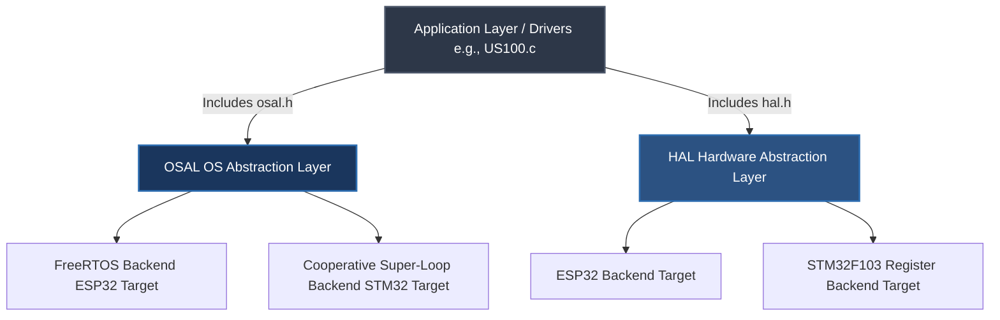

# Dual-Architecture Embedded Framework

A highly modular, dual-backend embedded firmware system demonstrating clean Operating System Abstraction Layer (OSAL) and Hardware Abstraction Layer (HAL) design patterns. This project showcases completely portable application logic capable of running on high-level RTOS frameworks (**ESP32 via ESP-IDF**) as well as low-level register-driven targets (**Bare-Metal STM32F103**).

---

## 🏗️ Architectural Layout

The software is structured with a strict dependency inversion hierarchy. The Core Application and device drivers possess zero knowledge of the underlying microchip registers or operating system execution layers.


### 📂 Repository File Structure

```text
├── main/                           # Application & Core Driver Layer
│   ├── main.c                      # Portable, hardware-agnostic runtime execution entry
│   └── ultrasonic/                 # Non-blocking, event-driven sensor driver implementation
│       ├── ultrasonic.c
│       └── ultrasonic.h
│
├── components/                     # Architecture Separation Subsystems
│   ├── my_hal/                     # Hardware Abstraction Layer (HAL)
│   │   ├── include/                # Hardware-agnostic common HAL peripheral definitions
│   │   │   └── hal.h
│   │   ├── src/                    # Shared HAL management routines
│   │   │   └── hal.c               # Default fallback/stub implementations for host-side testing
│   │   │
│   │   ├── esp32/                  # ESP32 Target: Native ESP-IDF framework bindings
│   │   │   ├── esp32.c / .h        # Target-specific initialization & GPIO interrupt configurations
│   │   │   └── esp32_uart.c / .h   # Native ESP-IDF UART peripheral tracking
│   │   │
│   │   └── stm32/                  # STM32 Multi-Chip Abstraction Engine
│   │       ├── addr.h              # Unified base address mappings for STM32 peripherals
│   │       ├── stm32_func.h        # Cross-chip bridge interface (e.g., abstract port routing prototypes)
│   │       ├── stm32.c / .h        # Unified STM32 common peripheral interface routing
│   │       ├── stm32_uart.c / .h   # Register-level BRR, CR1, and status polling engines
│   │       └── stm32f103/          # Concrete MCU Implementation Layer
│   │           ├── cortexm3.c / .h # ARM Cortex-M3 core configuration and SysTick definitions
│   │           ├── stm32f103_intr.c / .h # Register-level EXTI & NVIC asynchronous interrupt mapping
│   │           ├── stm32f103.c / .h # Target-specific port addresses and hardware configurations
│   │           ├── stm32f103.ld    # Custom Linker Script defining memory-mapped Flash/SRAM regions
│   │           └── stm32f103.s     # Low-level Assembly startup file (vector table & context reset)
│   │    
│   └── osal/                       # Operating System Abstraction Layer (OSAL)
│       ├── include/                # Abstract multi-task scheduling & queue primitives
│       │   └── osal.h
│       ├── src/                    # Shared OSAL interface wrappers
│       │   └── osal.c
│       └── freertos/               # ESP32 Target: FreeRTOS kernel implementation
│           └── freertos.c / .h     # Native FreeRTOS queue & task bindings
│
├── test/                           # Off-Silicon Host Verification Suite (x86_64)
│   ├── hal_wrapper.hpp             # Virtual proxy isolation harness for GoogleMock
│   ├── test_keys.hpp               # Mock behavior expectations and injection constants
│   └── ultrasonic_test.cpp         # GoogleTest suite (ISR stimulus & edge-case validation)
│
└── build_script.sh                 # Unified automation cross-compilation & flash entry point

```

### Key Software Engineering Pillars

* **Compile-Time Word Size Aliasing:** Implements deterministic, zero-overhead pointer-width evaluation via `UINTPTR_MAX`. Types like `uint_m` and constants like `SYS_SIZE` dynamically match the 32-bit width of target MCUs or 64-bit width of host verification environments automatically.
* **Event-Driven Ultrasonic Driver (US100):** A highly optimized, non-blocking sensor driver. Instead of using CPU-heavy polling loops, it utilizes an edge-triggered GPIO **Interrupt Service Routine (ISR)** to capture raw hardware pulse transitions with microsecond precision, passing data safely to the application layer via ISR-safe OSAL primitives.
* **Safe Encapsulated Primitives:** Prevents raw pointer leaks by wrapping critical OS structures (like `osal_queue_t` and `osal_taskhandle_t`) inside structured pass-by-value wrappers.
* **Memory-Bounded Diagnostic Logging:** Directs a thread-safe, context-tagged variant of `printf` through `esp32_log_info` using bounded stack allocation arrays and `vsnprintf` to completely eliminate risks of heap fragmentation or stack-smashing buffer overflows.

---

## 🛠️ Features & Implemented Modules

### ⏱️ Advanced Deterministic Timing & Portability
* **Dual-Engine Time Slicing:** Engineered a hybrid timing system utilizing sub-millisecond hardware clocks (`esp_timer`) for microsecond-precision pulse measurement alongside deterministic FreeRTOS tick counters for macro-level task scheduling.
* **Deterministic Time-to-Tick Translation:** Encapsulated all OSAL delay primitives to automatically compute compile-time and runtime millisecond-to-RTOS-tick translations ($ms \rightarrow \text{ticks}$), ensuring application logic remains completely decoupled from the underlying kernel's clock frequency ($f_{\text{tick}}$).
* **Cross-Architecture Type Safety:** Enforced absolute type determinism across all abstraction interfaces using `<stdint.h>` primitives, utilizing custom architecture-mapped macros (`UINT_M`) within the OSAL to guarantee variable width compliance regardless of compilation on 32-bit silicon or a 64-bit host simulation PC.

### 🔄 Event-Driven State-Machine & ISR Handoff
* **Atomic Struct State Packaging:** Designed a non-blocking ISR handoff mechanism that packages edge-triggered pulse timestamps into specialized tracking structures, leveraging low-overhead state notification callbacks to alert application tasks the exact microsecond a complete measurement lifecycle finishes.
* **OSAL Core Subsystem:** Standardized abstract interfaces for multi-task scheduling primitives, binary signaling notification states, absolute loop delays (`osal_task_delay_until_ms_default`), and thread-safe queue pipelines.
* **Ultrasonic Distance Sensing Driver (US100):** A completely hardware-agnostic sensor driver that executes logic entirely through abstract HAL GPIO and UART interface boundaries.
* **Strict Build Enforcements:** Pre-configured via CMake to force `-Wall -Wextra -Werror` compiler flags strictly on custom logic targets while allowing vendor framework dependencies to build unmodified.

---
## 🔄 Architectural Data Flow (ISR-to-Task Pipeline)

Because the sensor relies on precise time-of-flight measurements, data acquisition is entirely split into an asynchronous outbound trigger and a dual-edge edge-triggered inbound capture stream. The main application loop remains completely non-blocking, executing continuous evaluation without putting the processor into a deep sleep state.

### Transimitting Sonic Burst 
```text
[Application Task] ──> [HAL GPIO Write] ──> [US100 Trigger Pin HIGH for 10µs] ──> [Sensor Transmits Sonic Burst]
```

### Receiving Sonic Burst
```text                                             
[Echo Pin Goes HIGH] ──> [EXTI Rising Edge ISR]  ──> [Capture Start Timestamp (t1)]
                                                             │
                                                     (Sensor waiting...)
                                                             │
[Echo Pin Goes LOW]  ──> [EXTI Falling Edge ISR] ──> [Capture End Timestamp (t2)]
                                                             │
                                                     [Calculate Delta: t2 - t1]
                                                             │
                                                     [OSAL Queue Push (Atomic Struct)]
                                                             │
                                                     [Application Dequeues & Outputs Distance]
```

---

## 🚀 Project Evolution Roadmap

This project was built using an organic, test-driven refactoring pipeline—moving step-by-step from raw hardware execution to a fully decoupled, production-ready architecture:

### 🟢 Done
- [x] **Phase 1: Framework Prototyping** – Establish baseline sensor execution by driving the US100 Ultrasonic Sensor using the native ESP-IDF HAL.
- [ ] **Phase 2: Event-Driven Optimization** – 
    - [x] **2.1 Migration to ISR:** Migrate from blocking task-polling routines to an asynchronous, edge-triggered GPIO Interrupt Service Routine (ISR) via the ESP-IDF interrupt matrix for microsecond-accurate pulse timing.
    - [x] **2.2 Asynchronous Data Pipeline:** Implemente an internal FreeRTOS queue mechanism to decouple data collection from processing. The primary execution thread enqueues raw sensor readings, enabling background tasks to dequeue and handle telemetry asynchronously.

- [x] **Phase 3: Hardware Abstraction Layer (HAL)** – Cleanly isolate the physical silicon dependencies into a dedicated abstraction layer (`hal.h`) to decouple hardware control from application logic.

- [x] **Phase 8.1 Core Logic Isolation:** Configure the CMake build system to compile pure-C modules within a C++ test harness via `extern "C"`.
- [x] **Phase 8.2 HAL Peripheral Interface Mocking:** Architect an `extern "C"` virtual proxy harness around `hal.h` boundaries, enabling **GoogleMock** to intercept low-level driver execution entirely off-silicon.

- [x] **Phase 4: Operating System Abstraction Layer (OSAL)** – Wrap FreeRTOS kernel primitives into a non-blocking execution layer (`osal.h`) to handle thread-safe scheduling, timing, and queues.

- [x] **Phase 5: Serial Communication Core** – Implement low-level UART transmission protocols and integrated memory-bounded logging channels for target diagnostics.

- [x] **Phase 6: Polymorphic Driver Binding** – Refactor the core UART drivers into the modular HAL configuration matrix (`hal_uart`).

- [ ] **Phase 7: Bare-Metal STM32F103 Register Integration** –
    - [x] **7.1 STMF103 Clock and GPIO:** Port the abstract HAL interfaces down to direct Memory-Mapped I/O register layouts (GPIO & USART clock gating, status polling) on the STM32F103 platform.
    - [x] **7.2 STM32 UART Peripheral Engine:** Port abstract serial interfaces down to direct Memory-Mapped I/O register layouts, configuring clock gating (APB2ENR & APB1ENR), baud rate generation (BRR), control pipelines (CR1), and status-driven transmission polling (SR / TXE).
    - [x] **7.3: STM32 Asynchronous EXTI Interrupt Engine** – Implementing raw hardware external interrupt configuration (EXTI) and basic timer captures on the STM32 to match the asynchronous performance of the ESP32 build.

### 🟡 In Progress
- [ ] **Phase 2.3: ISR Defense** ISR Defensive Bounds & Race-Condition Mitigation
- [ ] **Phase 7.4: Watchdog integration:** Implement an independent hardware watchdog (IWDG) using direct register manipulation, establishing a reliable hardware-driven fallback to catch and recover from system lockups or frozen execution loops.
- [ ] **Phase 7.5 STM32 Scheduling and Threads:** Engineer a custom, preemptive Round-Robin scheduler driven by the ARM SysTick heartbeat, utilizing assembly context switching (PendSV) and custom Task Control Blocks (TCBs) to run multiple independent threads.

- [ ] **Phase 8: Host-Side C++ Simulation & Testing Engine (GoogleTest / GoogleMock)** –
  - [ ] **8.3 OSAL Queue & Task Mocking:** Implement strict mocks for `osal.h` primitives to simulate task synchronization and thread-safe data pipelines on the host PC.
  - [ ] **8.4 Asynchronous ISR Injection:** Write a gtest test fixture that simulates hardware events by manually invoking the US100 interrupt service handler, verifying that the timestamp data routes correctly through the mocked OSAL layer.
  - [ ] **8.5 Defensive Edge-Case Verification:** Validate the driver's state machine against simulated hardware faults, including timeout constraints, corrupted UART frames, and invalid ultrasonic echo pulse widths.

- [ ] **Phase 9: Technical Documentation & Systems Modeling** – Authoring a comprehensive architectural design document containing unified sequence diagrams and finite state machine (FSM) flowcharts mapping asynchronous ISR-to-Task handoffs.
- [ ] **Phase 10: CI/CD Automated Verification Pipeline** – Integrating a GitHub Actions workflow to automatically run cross-compiler verification (both `idf.py` and the STM32 toolchain) on every repository commit.

---

## 💻 Getting Started

### Prerequisites
* **For ESP32 Builds:** Espressif ESP-IDF SDK (v6.1+) installed and configured in your path
* **For STM32 Builds:** ARM GNU Toolchain (`arm-none-eabi-gcc`) and an open-source flash utility (e.g., `st-flash` or `OpenOCD`)
* **Core Build Engine:** CMake and Ninja build systems

### Building and Flashing via Unified Automation Script

The repository includes a unified `build_script.sh` engine that abstracts away individual framework build tools, handling environment configuration, cross-compilation, target flashing, and serial monitoring automatically based on your platform argument.

```bash
# Clone the repository workspace
git clone [https://github.com/yourusername/modular-sensor-actuator.git](https://github.com/yourusername/modular-sensor-actuator.git)
cd modular-sensor-actuator

# Make the automation engine executable
chmod +x build_script.sh

# Target Option A: Compile, flash, and monitor the ESP32 framework
./build_script.sh ESP32

# Target Option B: Compile, and flash the Bare-Metal STM32F103 platform
./build_script.sh STM32
```
