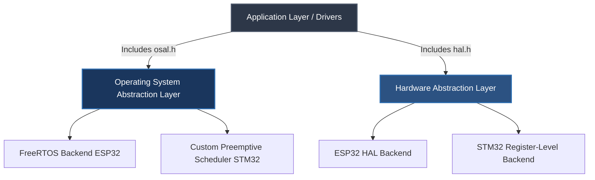

# Portable Embedded Framework and Cortex-M3 Scheduler

A modular embedded firmware framework demonstrating portable firmware architecture through a clean Hardware Abstraction Layer (HAL) and Operating System Abstraction Layer (OSAL). The project targets both ESP32 (ESP-IDF / FreeRTOS) and STM32F103 (Bare-Metal ARM Cortex-M3) while keeping application logic independent of vendor SDKs, MCU registers, and operating system implementations.

The STM32 backend includes a custom preemptive scheduler implemented using SysTick, SVC, and PendSV context switch, demonstrating low-level ARM Cortex-M scheduler design without relying on a third-party RTOS.


## Philosophy

Development progresses in stages: first achieving functional parity across supported platforms, then improving reliability through verification, documentation, and automated testing.


## Design Decisions

### Hardware and Operating System Abstraction

The HAL and OSAL layers were introduced to separate application logic from hardware registers and operating system implementations.

### Static Memory Allocation

The STM32 backend avoids heap allocation to provide predictable memory usage and simplify debugging.

### Custom Scheduler

The STM32 scheduler was developed to explore ARM Cortex-M exception handling, context switching, and embedded operating system concepts.

## Known Limitations

The STM32 backend is intentionally a lightweight scheduler implementation rather than a complete RTOS.

Current limitations include:

- No synchronization primitives
- No task deletion
- No dynamic memory allocation
- No stack overflow monitoring
- Limited fault recovery
- Limited automated test coverage


## 🏗️ Architectural Layout

The software is structured with a strict dependency inversion hierarchy. The Core Application and device drivers possess zero knowledge of the underlying microchip registers or operating system execution layers.




## 🛠️ Features
### ⚙️ Custom Preemptive Scheduler (STM32F103)
**Custom scheduler for the ARM Cortex-M3.**
The STM32 scheduler is intentionally lightweight and focuses on ARM Cortex-M scheduling fundamentals.

Currently implemented:
- Fixed maximum of 12 tasks
- Static task allocation
- SysTick-driven preemption
- Independent task stacks
- Task sleeping through delay primitives

Not currently implemented:
- Priority scheduling
- Inter-task synchronization primitives
- Task deletion
- Stack overflow detection
- Runtime statistics

### 🔌 Hardware Abstraction Layer (HAL)
**Platform-independent peripheral interfaces.**
* Register-level STM32 implementation.
* ESP-IDF backend implementation.
* GPIO, UART, and interrupt abstraction.
* Designed so application code is portable across supported targets.

### 🧩 Operating System Abstraction Layer (OSAL)
* Abstract task creation.
* Task delay APIs.
* Scheduler startup.
* Portable interfaces shared between the FreeRTOS backend and the custom STM32 scheduler.

### 📡 Event-Driven Ultrasonic Driver
**Non-blocking US100 ultrasonic driver.**
* Interrupt-driven pulse capture.
* Hardware-independent driver using only HAL and OSAL interfaces.
* Host-side unit tests using GoogleTest/GoogleMock for selected driver functionality.

### 🛠️ Development Practices
* Static memory allocation on the STM32 scheduler (no heap usage).
* Strict compiler warnings (-Wall -Wextra -Werror) on project sources.
* Portable integer types using <stdint.h>.
* CMake-based build system supporting multiple targets.

## 🔄 Architectural Data Flow (ISR-to-Task Pipeline)

Because the sensor relies on precise time-of-flight measurements, data acquisition is entirely split into an asynchronous outbound trigger and a dual-edge edge-triggered inbound capture stream. The main application loop remains completely non-blocking and executes continuous evaluation.

### Transmitting Sonic Burst 
```text
[Application Task] ──> [HAL GPIO Write] ──> [US100 Trigger Pin HIGH for 10µs] ──> [Sensor Transmits Sonic Burst]
```

### Receiving Sonic Burst
```text                                             
[Echo Pin Goes HIGH] ──> [EXTI Rising Edge ISR]  ──> [Capture Start Timestamp (t1)]
                                                             │
                                                     (Sensor waiting...)
                                                             │
[Echo Pin Goes LOW]  ──> [EXTI Falling Edge ISR] ──> [Capture End Timestamp (t2)]
                                                             │
                                                     [Calculate Delta: t2 - t1]
                                                             │
                                                     [OSAL Queue Push (Distance information)]
                                                             │
                                                     [Application Dequeues & Outputs Distance]
```

---
## 🛠️ Implementation Status

The project currently contains two execution backends:

| Component | ESP32 | STM32F103 |
|---|---|---|
| HAL | ✅ Implemented | ✅ Implemented |
| OSAL | ✅ FreeRTOS backend | ✅ Custom scheduler backend |
| Interrupts | ✅ Implemented | ✅ Implemented |
| Task scheduling | ✅ FreeRTOS | ✅ Preemptive scheduler |
| Queues | ✅ FreeRTOS | 🚧 Planned |
| Synchronization primitives | ✅ FreeRTOS | 🚧 Planned |
| Host testing | ✅ Partial | 🚧 Planned |
---

## 🚀 Project Evolution Roadmap

This project was developed through an incremental refactoring process, evolving step-by-step from direct hardware experimentation into a modular embedded architecture with clear hardware and operating system boundaries. Future phases focus on verification, hardening, documentation, and automated testing to further improve reliability and maintainability.

### 🟢 Done
- [x] **Phase 1: Framework Prototyping** – Establish baseline sensor execution by driving the US100 Ultrasonic Sensor using the native ESP-IDF HAL.
- [ ] **Phase 2: Event-Driven Optimization** – 
    - [x] **2.1 Migration to ISR:** Migrate from blocking task-polling routines to an asynchronous, edge-triggered GPIO Interrupt Service Routine (ISR) via the ESP-IDF interrupt matrix for microsecond-accurate pulse timing.
    - [x] **2.2 Asynchronous Data Pipeline:** Implement an internal FreeRTOS queue mechanism to decouple data collection from processing. The primary execution thread enqueues raw sensor readings, enabling background tasks to dequeue and handle telemetry asynchronously.

- [x] **Phase 3: Hardware Abstraction Layer (HAL)** – Cleanly isolate the physical silicon dependencies into a dedicated abstraction layer (`hal.h`) to decouple hardware control from application logic.

- [x] **Phase 4: Operating System Abstraction Layer (OSAL)** – Wrap FreeRTOS kernel primitives into a portable execution layer (osal.h) for task scheduling, timing, and queue management while preserving the synchronization guarantees provided by the underlying RTOS.

- [x] **Phase 5: Serial Communication Core** – Implement low-level UART transmission protocols and integrated memory-bounded logging channels for target diagnostics.

- [x] **Phase 6: Polymorphic Driver Binding** – Refactor the core UART drivers into the modular HAL configuration matrix (`hal_uart`).

- [ ] **Phase 7: Bare-Metal STM32F103 Register Integration** –
    - [x] **7.1 STMF103 Clock and GPIO:** Port the abstract HAL interfaces down to direct Memory-Mapped I/O register layouts (GPIO & USART clock gating, status polling) on the STM32F103 platform.
    - [x] **7.2 STM32 UART Peripheral Engine:** Port abstract serial interfaces down to direct Memory-Mapped I/O register layouts, configuring clock gating (APB2ENR & APB1ENR), baud rate generation (BRR), control pipelines (CR1), and status-driven transmission polling (SR / TXE).
    - [x] **7.3: STM32 Asynchronous EXTI Interrupt Engine** – Implementing raw hardware external interrupt configuration (EXTI) and basic timer captures on the STM32 to match the asynchronous performance of the ESP32 build.
    - [x] **Phase 7.4 STM32 Scheduling and Threads:** Engineer a custom, preemptive Round-Robin scheduler driven by the ARM SysTick heartbeat, utilizing assembly context switching (PendSV) and custom Task Control Blocks (TCBs) to run multiple independent threads.

### 🟡 In Progress
- [ ] **Phase 7.5: Watchdog integration:** Implement an independent hardware watchdog (IWDG) using direct register manipulation, establishing a reliable hardware-driven fallback to catch and recover from system lockups or frozen execution loops.


- [ ] **Phase 8: Host-Side C++ Simulation & Testing Engine (GoogleTest / GoogleMock)** –
  - [x] **Phase 8.1 Core Logic Isolation:** Configure the CMake build system to compile pure-C modules within a C++ test harness via `extern "C"`.
  - [x] **Phase 8.2 HAL Peripheral Interface Mocking:** Architect an `extern "C"` virtual proxy harness around `hal.h` boundaries, enabling **GoogleMock** to intercept low-level driver execution entirely off-silicon.
  - [ ] **8.3: Defensive code hardening:** Engineer input-boundary validation and fault-tolerant state recovery routines to ensure deterministic system behavior when processing corrupted or out-of-bounds sensor telemetry.
  - [ ] **8.4 ISR Defense & Thread race conditions:** ISR Defensive Bounds & Race-Condition Mitigation
  - [ ] **8.5 OSAL Queue & Task Mocking:** Implement strict mocks for `osal.h` primitives to simulate task synchronization and thread-safe data pipelines on the host PC.
  - [ ] **8.6 Asynchronous ISR Injection:** Write a gtest test fixture that simulates hardware events by manually invoking the US100 interrupt service handler, verifying that the timestamp data routes correctly through the mocked OSAL layer.
  - [ ] **8.7 Defensive Edge-Case Verification:** Validate the driver's state machine against simulated hardware faults, including timeout constraints, corrupted UART frames, and invalid ultrasonic echo pulse widths.

- [ ] **Phase 9: Technical Documentation & Systems Modeling** – Authoring a comprehensive architectural design document containing unified sequence diagrams and finite state machine (FSM) flowcharts mapping asynchronous ISR-to-Task handoffs.
- [ ] **Phase 10: CI/CD Automated Verification Pipeline** – Integrating a GitHub Actions workflow to automatically run cross-compiler verification (both `idf.py` and the STM32 toolchain) on every repository commit.


## 💻 Getting Started

### Prerequisites
* **For ESP32 Builds:** Espressif ESP-IDF SDK (v6.1+) installed and configured in your path
* **For STM32 Builds:** ARM GNU Toolchain (`arm-none-eabi-gcc`) and an open-source flash utility (e.g., `st-flash` or `OpenOCD`)
* **Core Build Engine:** CMake and Ninja build systems

### Building and Flashing via Unified Automation Script

The repository includes a unified `build_script.sh` engine that abstracts away individual framework build tools, handling environment configuration, cross-compilation, target flashing, and serial monitoring automatically based on your platform argument.

```bash
# Make the automation engine executable
chmod +x build_script.sh

# Target Option A: Compile, flash, and monitor the ESP32 framework
./build_script.sh ESP32

# Target Option B: Compile, and flash the Bare-Metal STM32F103 platform
./build_script.sh STM32
```
